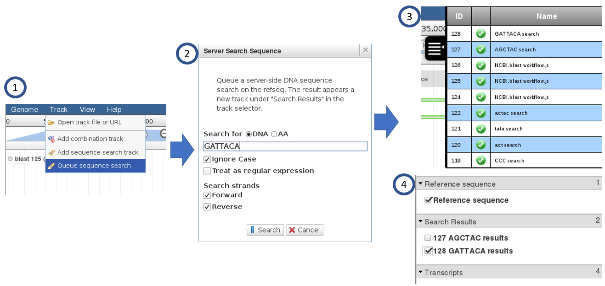

Client Side Demo
================

The server can be tested with the Sequence Search plugin feature that is automatically installed.

To run:

1. Select *Queue sequence search* from the Track menu.  This is functionally equivelant
   to add *Add sequence search track*, which is the client-side regexSearch plugin.
   However, this performs the search on the server side through a job submission.
2. Enter a DNA sequence and click the *Search* button.
3. The job queue panel will show activity while the job is being run.  When completed,
   The job will show a green status icon.
4. The track selector will show results under the *Search Results* section.  View the 
   search results by clicking.

