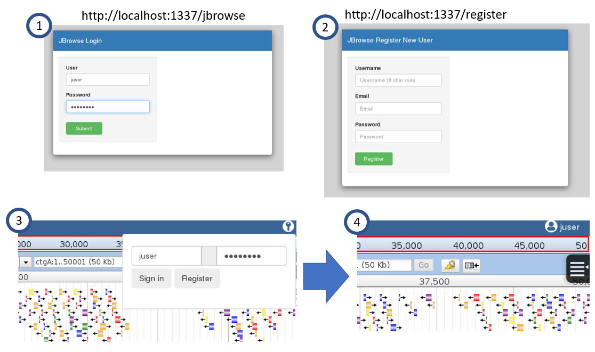
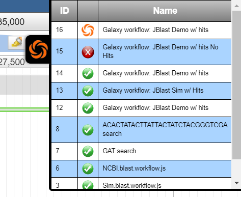

********
Features
********

.. _jbs-features:

JBConnect is a server/analysis framework for JBrowse and has the following features:

+------------------------------------------------------------------------------------+
| `Sails JS <http://sailsjs.org>`_ - `NodeJS <http://nodejs.org>`_/Expressed-based   |
+------------------------------------------------------------------------------------+
| Tightly integrated with JBrowse                                                    |
+------------------------------------------------------------------------------------+
| Track & Dataset Management with JBrowse integration                                |
|                                                                                    |
| * RESTful track data access                                                        |
| * Track API (CRUD)                                                                 |
| * Auth and Secure Tracks/Datasets/Assets                                           |
| * Track/Asset SubPub events with `Socket.io <http://socket.io>`_                   |
+------------------------------------------------------------------------------------+
| Extensible server-side analysis enables integration with Galaxy workflows or       |
| stand-alone workflows.                                                             |
+------------------------------------------------------------------------------------+
| Job queue - based on kue
+------------------------------------------------------------------------------------+
| Flexible Authentication – (`Passport.js <http://passportjs.org>`_) supporting      |
| strategies, like OAuth2, OpenID, etc.                                              |
+------------------------------------------------------------------------------------+
| Basic user management services                                                           |
+------------------------------------------------------------------------------------+
| Policy Engine for managing access to Tracks, Datasets, Services, Assets            |
+------------------------------------------------------------------------------------+
| `Waterline ORM <http://waterlinejs.org/>`_ (MongoDB, MySQL, Postgres, Redis, etc.) |
| with integrated                                                                    |
| `Blueprint <https://sailsjs.com/documentation/concepts/blueprints>`_ object models |
+------------------------------------------------------------------------------------+
| npm installable hook model supporting both client-side (JBrowse plugins)           |
| and server-side extensions in a single package.                                    |
+------------------------------------------------------------------------------------+
| Grunt – task management (minification, watches, etc.)                              |
+------------------------------------------------------------------------------------+

Directory Layout
================

::

    JBConnect project
    ├── api                             Standard sails API layout, models, controllers, etc.
    ├── assets                          contains client accessible assets
    ├── bin                             Utilities
    ├── config                          Configuration files.
    │   └── globals.js                  global config file for module
    ├── data                            Contains the local database file
    │   └── localDiskDb.db              Local database file
    ├── docs                            Documentation
    │   └── genapi-rst                  jsdoc generated rst files
    ├── plugins                         Client-side Plugins
    │   └── JBClient                    Client plugin             
    ├── test                            Test
    ├── views                           Login / registration pages
    ├── Gruntfile.js                    Grunt config
    ├── jbutil                          JBConnect Utility (exe)
    └── package.json

jbutil Command
==============

``jbutil`` is a setup/configuration utility for JBConnect.  *-jbconnect-hook modules can extend
``jbutil`` command options. (see: :ref:`jbs-hooks-extend`)

This example shows that ``JBlast`` adds a number of commands to ``jbutil``

todo: update help

::

    $ ./jbutil --help
    Usage: jbutil [OPTION]
          --config            display aggregated config
          --blastdbpath=PATH  (jblast) existing database path
          --setupworkflows    (jblast) [install|<path>] "install" project wf, or specify .ga file 
          --setuptools        (jblast) setup jblast tools for galaxy
          --setupdata         (jblast) setup data and samples
          --setupindex        (jblast) setup index.html in the jbrowse directory
          --setuphistory      setup history
      -h, --help              display this help

See: jbs-jbutilextending_

.. _jbs-queue-framework:

Queue Framework
===============

JBConnect uses `Kue <https://automattic.github.io/kue/>`_ as the basis for the queue framework.
However, Kue is encapsulated in the Job model/controller.  
Since Kue requires `redis <https://redis.io/>`_ database, 
redis server must be running.  An integrated job panel is available when
the JBClient plugin is active. (see: :ref:`jbs-jbclient`)

For diagnostic purposes, a Kue utility can be used to view/manage the Kue database
content: ``http://localhost:1337/kue``

This route can be disabled with in config/http.js.

.. _jbs-globals-config:

Configuration
=============

JBConnect configurations are in ``config/globals.js``

:: 

    jbrowse: {
        jbrowseRest: "http://localhost:1337",       // path accessible by web browser
        jbrowsePath: jbPath,                        // or point to jbrowse directory (ie. "/var/www/jbrowse/") 
        routePrefix: "jbrowse",                     // jbrowse is accessed with http://<addr>/jbrowse
        dataSet: [
            {
                dataPath: "sample_data/json/volvox" // registered datasets.  
            }
        ]
    }

Client-Side Plugins
===================

Client-side plugins are in the `plugins` directory.  Plugins will automatically
be accessible by the client side.  However, they need to be configured in the `plugins:`
section of the particular dataset in JBrowse `trackList.json`.

Plugins are copied to the configured JBrowse instance upon ``sails lift``.

Web Includes
============

libroutes maps dependancy routes for client-side access.
These provide access to modules that are required for use by the client-side 
plugins or other client-side code.
The framework looks for libroutes.js in , in their respective config directories

For example: for the module jquery,
The module is installed with 'npm install jquery'
The mapping the mapping 'jquery': '/jblib/jquery'
makes the jquery directory accessible as /jblib/jquery from the client side.

Library Routes are virtual routes, in that they only exist when the server is lifted.
They are virtually mapped to their respective locations in the node_modules directory.

``config/libroutes.js``:

::

    module.exports = {
        lib: {
                'jquery.mb.extruder':       '/jblib/mb.extruder',
                'jQuery-ui-Slider-Pips':    '/jblib/slider-pips',
                'jquery-ui-dist':           '/jblib/jquery-ui'
        }
    };

Standalone Register / Login / Logout Routes
===========================================

Stand-alone routes allow for basic register/login/logout functionality free
from the JBrowse interface.  

Logout: ``http://<address>:1337/logout``

Get Login State: ``http://<address>:1337/loginstate``

The routes are defined in `config/routes.js`.

*Note: Stand-alone interfaces use `bootstrap <http://getbootstrap.com/>`_*
 

Login/Logout Panel
------------------

Login Panel

.. image:: img/login-integrated.jpg

Loguot Panel

.. image:: img/logout-integrated.jpg

Job Queue Panel
---------------

JBConnect uses *Kue* as the queue framework.  Since Kue requires *redis* database, 
redis server must be running.  An integrated job panel is available when
the JBClient plugin is active. (see: :ref:`jbs-jbclient`)

Integrated Job Panel:

Test Framework
==============

Test framework uses

* Mocha for unit test
* Nightwatch for end-to-end, supporting phantomjs, selenium and online service such as browserstack.
* Istanbul for coverage

To execute

``npm test``

by default nightwatch is setup for phantomjs.
Selenium requires running an additional selenium server

``package.json``:

::

  "scripts": {
    "test": "nyc node ./node_modules/mocha/bin/mocha test/bootstrap.test.js test/integration/**/*.test.js test/e2e/**/*.test.js --nightwatch-test phantomjs",
  },

The option ``--nightwatch-test`` can be:

* ``phantomjs`` - runs client tests with phantomjs
* ``selenium`` - runs client tests with selenium
* ``browserstack`` - runs client test with selenium through remote browserstack account.

Documentation Framework
=======================

For integrated documentation, `JSdoc3 <http://usejsdoc.org/>`_ is used 
to generate API docs from code with jsdoc-sphinx, a jsdoc template that generates 
RestructuredText (RST) and Sphinx.  This enables support for 
`readthedocs <https://readthedocs.org/>`_.

See: `RST/Sphinx Cheatsheet <http://openalea.gforge.inria.fr/doc/openalea/doc/_build/html/source/sphinx/rest_syntax.html>`_  

Generate docs:
``npm run gendocs``

This will generate ``docs/api.rst``.  This must be committed and pushed for it
to appear in ``jbconnect.readthedocs.io``.