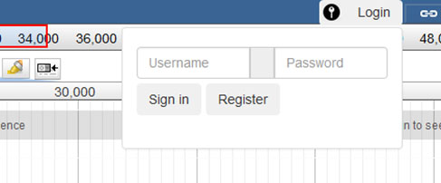

********
Features
********

JBServer is a Sails.js application
**********************************

JBServer utilizes Sails.js, provideing the following features

+-------------------------------------------------------------------------------+
| **Javascript** (NODE-based)                                                   |
+-------------------------------------------------------------------------------+
| **Blueprints** Auto-generate  CRUD APIs, ESTful APIs, Socket.io (events)      |
+-------------------------------------------------------------------------------+
| **Waterline** ORM, Any Database, MySql, PostgreSQL Mongo, Redis, local        |
+-------------------------------------------------------------------------------+
| **Express-based** Compatible routes & Middleware                              |
+-------------------------------------------------------------------------------+
| **Socket.io** sub/pub, WebSockets, Auto Integrate Models                      |
+-------------------------------------------------------------------------------+
| **Passport.js** role-based security, access control, OAuth                    |
+-------------------------------------------------------------------------------+
| **Installable** Hooks (jbh-*), Extensible plugin framework                    |
+-------------------------------------------------------------------------------+
| **Grunt** Customizable asset workflow, LESS, SASS, Stylus                     |
+-------------------------------------------------------------------------------+
| **Front-End Agnostic** Angular, backbone, bootstrap, ember, ...               |
+-------------------------------------------------------------------------------+

Directory Layout
================

::

    JBServer project
    ├── api                             Standard sails API layout
    ├── assets                          contains client accessible assets
    ├── bin                             Utilities
    ├── config                          Sails configuration files.
    │   ├── globals.js                  Config file for module
    │   └── libroutes.js                Library Routes
    ├── docs                            Documentation
    │   └── genapi-rst                  jsdoc generated rst files
    ├── plugins                         Client-side Plugins
    │   └── JBClient                    Client plugin             
    ├── test                            Test
    ├── views                           View pages
    ├── Gruntfile.js          
    └── package.json

Queue
=====

JBServer uses *Kue* as the queue framework.  Since Kue requires *redis* database, 
the redis server must be running.

Configuration
=============

Login / Logout
==============

Stand-alone
-----------

.. image:: img/register.jpg

.. image:: img/login.jpg

Integrated
----------

To enable integrated login/logout interfaces within the JBrowse app, modify the dataset's 
``trackList.json``, adding ``JBClient`` plugin to the configuration.

*Note: the JBClient plugin is not physically in the JBrowse plugin directory.
It is available as a route.*

::

  "plugins": [
    "JBClient",                    <-----
    "NeatHTMLFeatures",
    "NeatCanvasFeatures",
    "HideTrackLabels"
  ],

This makes the login panel available in JBrowse.

Login Panel

Loguot Panel
.. image:: img/logout-integrated.jpg

