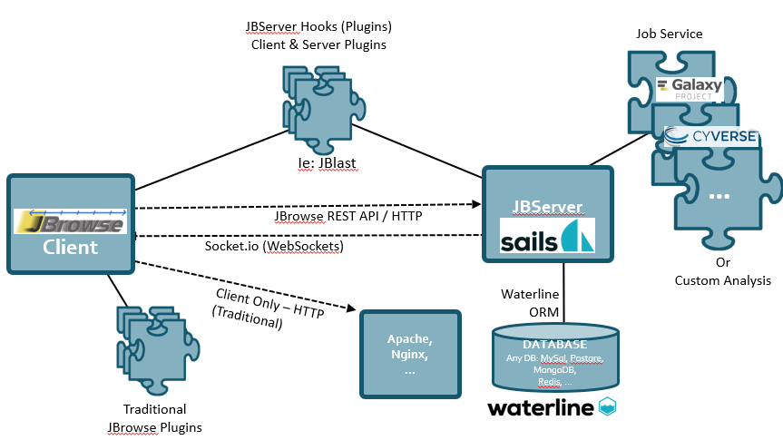

********
JBConnect
********

**JBConnect provides the following features:**

+------------------------------------------------------------------------------------+
| `Sails JS <http://sailsjs.org>`_ - `NodeJS <http://nodejs.org>`_/Expressed-based   |
+------------------------------------------------------------------------------------+
| Tightly integrated with JBrowse                                                    |
+------------------------------------------------------------------------------------+
| Track & Dataset Management with JBrowse integration                                |
|                                                                                    |
| * RESTful track data access                                                        |
| * Track API (CRUD)                                                                 |
| * Auth and Secure Tracks/Datasets/Assets                                           |
| * Track/Asset SubPub events with `Socket.io <http://socket.io>`_                   |
+------------------------------------------------------------------------------------+
| Flexible Authentication – (`Passport.js <http://passportjs.org>`_) supporting      |
| strategies, like OAuth2, OpenID, etc.                                              |
+------------------------------------------------------------------------------------+
| User management services                                                           |
+------------------------------------------------------------------------------------+
| Policy Engine f0r managing access to Tracks, Datasets, Services, Assets            |
+------------------------------------------------------------------------------------+
| Extensible server-side analysis with workflow abstraction and job queue            |
+------------------------------------------------------------------------------------+
| `Waterline ORM <http://waterlinejs.org/>`_ (MongoDB, MySQL, Postgres, Redis, etc.) |
| with integrated                                                                    |
| `Blueprint <https://sailsjs.com/documentation/concepts/blueprints>`_ object models |
+------------------------------------------------------------------------------------+
| npm installable hook model supporting both client-side (JBrowse plugins)           |
| and server-side extensions in a single package.                                    |
+------------------------------------------------------------------------------------+
| Grunt – task management (minification, watches, etc.)                              |
+------------------------------------------------------------------------------------+

Quick Start
===========

The quick start instructions demonstrate installing JBConnect with JBrowse
loaded as a an NPM module (since JBConnect is generally intended to be a companion of JBrowse.  
JBrowse may also be installed in a separate directory.
(See :ref:`jbs-separate-dir`.)

 
Pre-Install
-----------

JBConnect requires `sailsjs <https://sailsjs.com/>`_ and `redis <https://redis.io/>`_ . *Redis* is only used by the queue framework 
(`kue <https://www.npmjs.com/package/kue>`_)

:: 

    yum install redis
    redis-server
    npm install -g sails@1.0.2

Install
-------

Install the JBConnect and JBrowse.  jb_setup.js ensures the sample data is loaded.

::

    git clone http://github.com/gmod/jbconnect
    cd jbconnect
    npm install
    npm install @gmod/jbrowse@1.15.1
    patch node_modules/@gmod/jbrowse/setup.sh fix_jbrowse_setup.patch
    ./utils/jb_setup.js

The patch operation is needed to make JBrowse 1.15.1 setup.sh run properly.
If JBrowse is installed in another location, the patch should be run before setup.sh.

Run
---

Launch the server.

``sails lift``

From a web browser, access the application.

``http://localhost:1337/jbrowse``

You will arrive at the following screen

.. image:: img/login.png

The default username/password: juser/password

Contents
========

.. toctree::
   :maxdepth: 2

   features
   configuration
   hooks
   tutorials
   api

