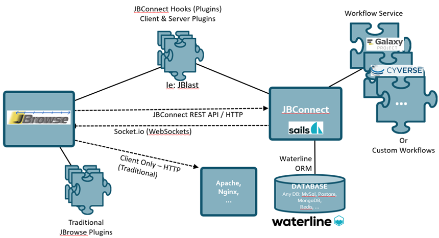

********
JBConnect
********

**JBConnect provides the following features:**

+------------------------------------------------------------------------------------+
| `Sails JS <http://sailsjs.org>`_ - `NodeJS <http://nodejs.org>`_/Expressed-based   |
+------------------------------------------------------------------------------------+
| Tightly integrated with JBrowse                                                    |
+------------------------------------------------------------------------------------+
| Track & Dataset Management with JBrowse integration                                |
|                                                                                    |
| * RESTful track data access                                                        |
| * Track API (CRUD)                                                                 |
| * Auth and Secure Tracks/Datasets/Assets                                           |
| * Track/Asset SubPub events with `Socket.io <http://socket.io>`_                   |
+------------------------------------------------------------------------------------+
| Flexible Authentication – (`Passport.js <http://passportjs.org>`_) supporting      |
| strategies, like OAuth2, OpenID, etc.                                              |
+------------------------------------------------------------------------------------+
| User management services                                                           |
+------------------------------------------------------------------------------------+
| Policy Engine f0r managing access to Tracks, Datasets, Services, Assets            |
+------------------------------------------------------------------------------------+
| Extensible server-side analysis with workflow abstraction and job queue            |
+------------------------------------------------------------------------------------+
| `Waterline ORM <http://waterlinejs.org/>`_ (MongoDB, MySQL, Postgres, Redis, etc.) |
| with integrated                                                                    |
| `Blueprint <https://sailsjs.com/documentation/concepts/blueprints>`_ object models |
+------------------------------------------------------------------------------------+
| npm installable hook model supporting both client-side (JBrowse plugins)           |
| and server-side extensions in a single package.                                    |
+------------------------------------------------------------------------------------+
| Grunt – task management (minification, watches, etc.)                              |
+------------------------------------------------------------------------------------+

Contents
========

.. toctree::
   :maxdepth: 2

   quick_start
   features
   setup
   jobservice
   hooks
   api

