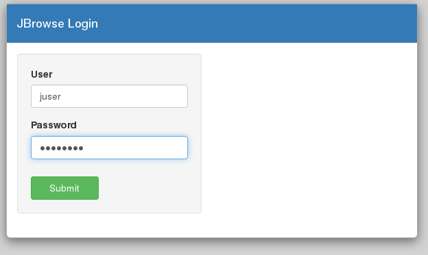

***********
Quick Start
***********

The quick start instructions demonstrate installing JBConnect with JBrowse
loaded as a an NPM module (since JBConnect is generally intended to be a companion of JBrowse.  
JBrowse may also be installed in a separate directory.
(See :ref:`jbs-separate-dir`.)

 
Pre-Install
===========

JBConnect requires `sailsjs <https://sailsjs.com/>`_ and `redis <https://redis.io/>`_ . *Redis* is only used by the queue framework 
(`kue <https://www.npmjs.com/package/kue>`_)

:: 

    yum install redis
    redis-server
    npm install -g sails@1.0.2

Install
=======

Install the JBConnect and JBrowse.  jb_setup.js ensures the sample data is loaded.

::

    git clone http://github.com/gmod/jbconnect
    cd jbconnect
    npm install
    npm install @gmod/jbrowse@1.15.1
    ./utils/jb_setup.js

Run
===

Launch the server.

``sails lift``

From a web browser, access the application.

``http://localhost:1337/jbrowse``

You will arrive at the following screen

The default username/password: juser/password

