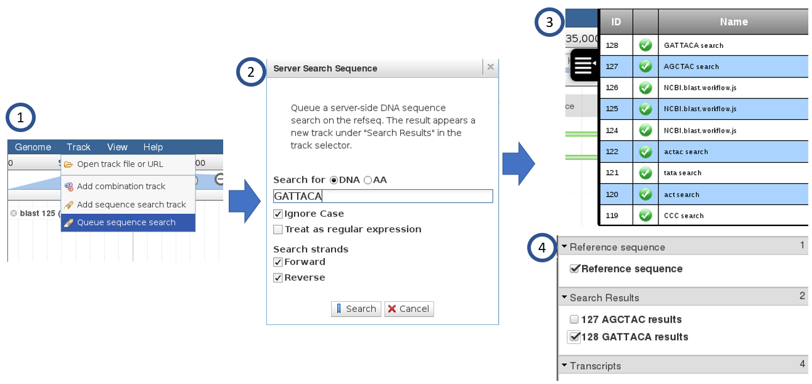

***********
Quick Start
***********

The quick start instructions demonstrate installing JBServer with JBrowse
loaded as a an NPM module (since JBServer is generally intended to be a companion of JBrowse.  
JBrowse may also be installed in a separate directory.
(See :ref:`jbs-separate-dir`.)

 
Pre-Install
===========

JBServer requires `redis <https://redis.io/>`_ as a pre-requisite, which is only used by the queue framework 
(`kue <https://www.npmjs.com/package/kue>`_).

Install and run *redis*

:: 

    yum install redis
    redis-server

Install
=======

Install the JBServer and JBrowse.  jb_setup.js ensures the sample data is loaded.

::

    git clone http://github.com/gmod/jbserver
    cd jbserver
    npm install

Run
===

Launch the server.

``sails lift``

From a web browser, access the application.

``http://localhost:1337/jbrowse``

You will arrive at the following screen

.. image:: img/login.png

The default username/password: juser/password

Client Side Demo
================

The server can be tested with the Sequence Search plugin feature that is automatically installed.

To run:

1. Select *Queue sequence search* from the Track menu.  This is functionally equivelant
   to add *Add sequence search track*, which is the client-side regexSearch plugin.
   However, this performs the search on the server side through a job submission.
2. Enter a DNA sequence and click the *Search* button.
3. The job queue panel will show activity while the job is being run.  When completed,
   The job will show a green status icon.
4. The track selector will show results under the *Search Results* section.  View the 
   search results by clicking.

