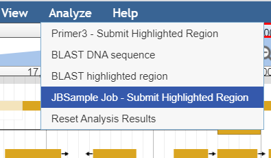
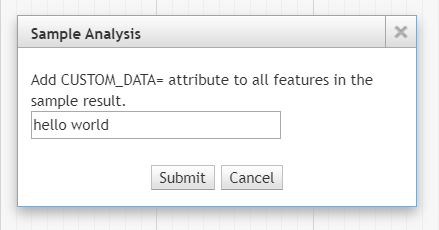

*********
Tutorials
*********

Creating a workflow that uses localCommonService Job Service
============================================================
``api/services/localCommonService.js`` is a workflow processing Job Service that can be used to execute general workflows scripts.
In this example, we present sample analysis module (JBSample).  We show how to create a client-side JBrowse plugin that integrates with JBrowse, 
adding a menu item under Analyze menu.  

It's a fully functional demo module that has a server-side execution shell script and performs
some arbitrary processing.  The example also demonstrates the client-side plugin collects user data in its submit dialog box and passes it
to be used by the execution script.

JBSample JBrowse Plugin
-----------------------

A sample plugin, JBSample source code can be found `here <https://github.com/GMOD/jbconnect/blob/master/plugins/JBSample/js/main.js>`_

In the file constructor of main.js, we find: 
::
    // analyze menu structure
    browser.jbconnect.analyzeMenus.JBSample = {
        title: 'Sample Analysis',
        module: 'JBSample',
        init:initMenu,
        contents:dialogContent,
        process:processInput
    };

where, 

* ``title`` is the title of the dialog box that is launched from the Analyze Menu.
* ``module`` is the module that is module name.  Coincides with module name used in `Configuration of sample workflow script`_
* ``init`` is the function that initializes the selection items in the Analyze Menu for the module.
* ``contents`` is a function that builds the contents of the dialog box.  This can be used to collect custom data prior to submitting.
* ``process`` is a function that collects the custom data from the fields created by ``contents`` to pass through the submit function.

In our example, the ``initMenu()`` does the setup of the Analyze menu item and when the item is selected by the user, it detects if a region has been 
highlighted.  This is a pretty common thing that is check by nearly all our processing modules.  If the region is not highlighted,
We show an instructional dialog box instructing the user to highlight a region using JBrowse's highlight feature.

In ``dialogContent()``, we render an additional field in the submit dialog box for CUSTOM_DATA.  The user can type any value in the input box.
Upon submitting the job, the demonstration shows how data is passed from the user end to the execution script.

``processInput()`` is called when the user clicks submit.  Here we show the custom input field data are cellected and we show how to pass the 
field data to the system and ultimately submitted to JBConnect.

Again, processing begins through ``localCommonService.js``, the thing that takes control of the job and launches the workflow script that was selected by the user.
Note, the user will not see the workflow selection box unless there are more than one workflow.  In our case, there is only one workflow script, so 
it will automatically be selected by the client plugin code.

sample.samp.wf.js Worflow Script
--------------------------------

The workflow script resides in the workflow directory.
In this example sample.samp.wf.js is a very simple script that copies sample.gff3 to the target directory; in demonstrating 
the passing of data from the client side to the server side script, it extracts the CUSTOM_DATA field that was captured
by the JBSample plugin and appends the value to every feature of sample.gff3. 
::
    # cmd <id> <jobid> <jobdata> <tmpdir> <outdir>
    echo "> my.sample.wf.sh " $0 $1 $2 $3 $4 $5

    # copy sample.gff3 to target dir
    cp ./bin/sample.gff3 "$5/$2.gff3"

    # extract value of CUSTOM_DATA
    MYVALUE=$(awk -v k=CUSTOM_DATA -F: '/{|}/{next}{gsub(/^ +|,$/,"");gsub(/"/,"");if($1==k)print $2}' $3)

    # add CUSTOM_DATA=MYVALUE as attribute to all features
    sed -e "s/$/;CUSTOM_DATA=$MYVALUE/" -i "$5/$2.gff3"

Note the 5 parameters that are passed to the command by ``localCommonService``.  

* $0  is the script path (ie: "/home/theuser/jbconnect/workflows/sample.samp.wf.sh")
* $1 <id> the job id (ie: "32")
* $2 <jobid> the job name (ie: "32-sample")
* $3 <jobdata> path of the job data file (ie: "/home/theuser/jbconnect/tmp/32-sample-jobdata.json")
* $4 <tmpdir> the directory where temporary or intermediate files might be placed.
* $5 <outdir> is the target directory where result files (like gff3 files) might be placed.

The full command looks something like this: 
::
    /home/theuser/jbconnect/workflows/sample.samp.wf.sh 32 32-sample 
      /home/theuser/jbconnect/tmp/32-sample-jobdata.json 
      /home/theuser/jbconnect/tmp /home/theuser/jb1151/sample_data/json/volvox/sample

``localCommonService`` expects to see a file <outdir>/<jobid>.gff3.  So, the script creates this result file in the target directory based on the given
input parameters of the script.  This is just the way ``localCommonService`` works.  If the application requires other result files, a another Job Service would need to be
created.  (see `Creating a Stand-Alone Job Service for local workflow processing`_)

The script can be found under the workflows dir, `here <https://github.com/GMOD/jbconnect/blob/master/workflows/sample.samp.wf.sh>`_

Configuration of sample workflow script
---------------------------------------

Configuration can be applied in ``globals.js`` or in ``JBConnect.config.js``
::

    workflowFilter: {
        JBSample: {filter: '.samp.wf'},
    },

The filter value corresponding to the module name, JBSample, is a filter that ``get_workflow`` of ``localCommonService`` uses to filter scripts that work with the particular module.

This configuration is required to enable the system to recognize the Job Service exists.
::
    services: {
        'localCommonService':       {enable: true, name: 'localCommonService',  type: 'workflow', alias:'workflow'}
    },

Creating a Stand-Alone Job Service for local workflow processing
================================================================

This tutorial demonstrates how to create a job service that can be executed by the JBlast Plugin.

The source code for the tutorial can be found `here <https://github.com/GMOD/jbconnect/blob/master/api/services/sampleJobService.js>`_

Job Runner functions
--------------------

The function map defines the REST APIs that the job service supports.
In the function map (``fmap``), ``get_workflow`` function is minimally require from the Process BLAST dialog.
``get_hit_details`` is not required since we don't actaully do a blast operation in the example.
::

    module.exports = {

        fmap: {
            get_workflows:      'get'
        },

**(required by Job Service)**

Provides opportunity to initialize the Job Service module.
::

        init(params,cb) {
            return cb();
        },

**(required by Job Runner Service)**

Provides mechanism to validate parameters given by the job queuer.
Since our example job is submitted by JBlast, we extect to see a region parameter.
::

        validateParams(params) {
            if (typeof params.region === 'undefined') return "region not undefined";
            return 0;   // success
        },

**(required by Job Runner Service)**

Job service generate readable name for the job that will appear in the job queue
::

        generateName(params) {
            return "sample job";
        },

**(required by JBClient, not required for Job Services in general)**

Return a list of available available options.  This is used to populate the Plugin's Workflow.
This should minimally return at least one item for JBlast client to work properly.
Here, we are just passing a dummy list, which will be ignored by the rest of the example.
::

        get_workflows (req, res) {
            
            wflist = [
                {
                    id: "something",
                    name: "sample do nothing job",
                    script: "something",
                    path: "./"
                }
            ];
            
            res.ok(wflist);
        },

**(required by Job Runner Service)**

``beginProcessing()`` is called by the job execution engine to begin processing.
The kJob parameter is a reference to the `Kue <https://www.npmjs.com/package/kue>`_ job.

::

        beginProcessing(kJob) {
            let thisb = this;
            let nothingName = "sample nothing ";
            
            kJob.data.count = 10;   // 10 seconds of nothing
            let f1 = setInterval(function() {
                if (kJob.data.count===0) {
                    clearInterval(f1);
                    thisb._postProcess(kJob);
                }
                // update the job text
                kJob.data.name = nothingName+kJob.data.count--;
                kJob.update(function() {});
            },1000);
        },

        //  (not required)
        //  After the job completes, we do some processing in postDoNothing() and then call 
        //  addToTrackList to insert a new track into JBrowse
        _postProcess(kJob) {
            
            // insert track into trackList.json
            this.postDoNothing(kJob,function(newTrackJson) {
                postAction.addToTrackList(kJob,newTrackJson);
            });
        },

        //  (not required)
        //  here, we do some arbitrary post prosessing.
        //  in this example, we are setting up a jbrowse track from a canned template.    
        postDoNothing(kJob,cb) {

            let templateFile = approot+'/bin/nothingTrackTemplate.json';
            let newTrackJson = [JSON.parse(fs.readFileSync(templateFile))];
            
            let trackLabel = kJob.id+' sample job results';
            
            newTrackJson[0].label = "SAMPLEJOB_"+kJob.id+Math.random(); 
            newTrackJson[0].key = trackLabel;     
            
            kJob.data.track = newTrackJson[0];
            kJob.update(function() {});

            cb(newTrackJson);
        }

Note that queue data can be changed with the following:
::

    kJob.data.name = nothingName+kJob.data.count--;
    kJob.update(function() {});

Configuration
-------------

To enable: edit jbconnect.config.js add the ``sampleJobService`` line under ``services`` and disable the other services.
::

    module.exports  = {
        jbrowse: {
            services: {
                'sampleJobService':         {enable: true,  name: 'sampleJobService',   type: 'workflow'},                    <====
                'localBlastService':        {enable: false, name: 'localBlastService',  type: 'workflow', alias: "jblast"},
                'galaxyBlastService':       {enable: false, name: 'galaxyBlastService', type: 'workflow', alias: "jblast"}
            },
        }
    };

Monitoring processing
---------------------

The job runner is responsible for monitoring the state of any potential lengthy analysis opertion.
If the job runner service is intended to perform some lengthy analysis, there would have
to be some mechanism to detect the completion of the operation. 

Completion processing
---------------------

To complete a job, call one of the following. 
::

    (success) kJob.kDoneFn();                                 
    (fail)    kJob.kDoneFn(new Error("failed because something"));

This will change the status of the job to either completed or error.

In our example, the helper library postAction handles the completion:     
::

    postAction.addToTrackList(kJob,newTrackJson);

Upon calling ``kJob.kDoneFn()``, the module is required to perform any necessary cleanup.

